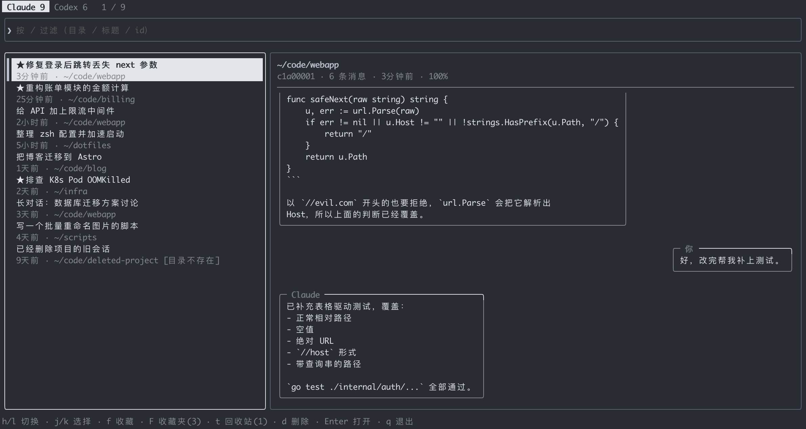

# agent-session-switch

English | [简体中文](README.zh-CN.md)

Pick a [Claude Code](https://claude.com/claude-code) or [Codex](https://github.com/openai/codex)
session from **any directory**, then jump to the directory it was started in and resume it.

`claude --resume` and `codex resume` only list sessions of the directory you are in. This tool lists
all of them in one place, with a live preview of the conversation.



## Install

```sh
go install github.com/iainen/agent-session-switch/cmd/agent-session-switch@latest
```

Or build from source:

```sh
git clone https://github.com/iainen/agent-session-switch
cd agent-session-switch
make build        # writes bin/agent-session-switch
```

Requires Go 1.26 or newer. Prebuilt binaries for Linux, macOS and Windows are attached to each
[release](https://github.com/iainen/agent-session-switch/releases).

The `claude` and/or `codex` command must be on your `PATH` for the sessions you want to resume.

## Usage

```sh
agent-session-switch               # open the picker
agent-session-switch price         # start with "price" in the filter
agent-session-switch -n 100        # load at most 100 recent sessions per agent
agent-session-switch -- --model x  # everything after -- is passed to claude/codex
agent-session-switch -version
```

Choosing a session changes into its original directory and runs
`claude --resume <id>` or `codex resume <id>`. The tool replaces itself with the agent, so your shell
sees the agent directly. Your current shell's directory is not changed, and you are back where you
started when the agent exits.

### Keys

| Key | Action |
| --- | --- |
| `j` / `k`, `↓` / `↑` | Move down / up |
| `g` / `G` | First / last |
| `PgUp` / `PgDn` | Move by 10 |
| `h` / `l`, `←` / `→` | Switch between Claude and Codex |
| `Enter` | Open the session (in the trash: restore it) |
| `/` | Filter by directory, title or id (space separates terms, all must match); `Esc` returns to navigation |
| `Ctrl-U` / `Ctrl-D`, mouse wheel | Scroll the preview |
| `f` | Favorite / unfavorite |
| `F` | Show favorites (press again to leave) |
| `d` | Move to the trash (asks first) |
| `t` | Show the trash (press again to leave) |
| `r` | Restore from the trash |
| `x` | Delete from the trash permanently (asks first) |
| `Tab` | Cycle sessions → favorites → trash |
| `q`, `Esc`, `Ctrl-C` | Quit (in favorites or the trash, `q` and `Esc` go back) |

Navigation keys are inactive while the filter box has focus, so you can type `j` or `k` into it.
Terminals narrower than 80 columns hide the preview.

## Where data lives

The tool reads the files the agents already write and keeps two small files of its own.

| Path | What | Written by this tool |
| --- | --- | --- |
| `~/.claude/projects/*/*.jsonl` | Claude Code sessions | moved to the trash on delete |
| `~/.codex/sessions/*/*/*/rollout-*.jsonl` | Codex sessions | moved to the trash on delete |
| `~/.codex/session_index.jsonl` | Codex session names | never |
| `~/.claude/session-favorites.json` | Your favorites | yes |
| `~/.claude/session-trash/` | Deleted sessions plus a `.json` file recording where each came from | yes |

Deleting a session with `d` **moves** its file into `~/.claude/session-trash/`; it is only removed
for good with `x`. Restoring puts it back at its original path and never overwrites an existing file.

Things to know:

- Only the conversation file is moved. Other data the agents keep about a session, such as Codex's
  own state, is left alone, so the agent's own UI may still know about a deleted session.
- Only the newest 300 sessions per agent are loaded (change with `-n`), so older favorites are
  saved but not shown.
- Codex sessions in `~/.codex/archived_sessions/` are not listed.
- The tool depends on the agents' undocumented file formats. If an agent changes its format, listing
  or previews may break until this tool is updated. Please open an issue.
- If `session-favorites.json` exists but cannot be parsed, favorites become read-only rather than
  overwriting it.

## Development

```sh
make check   # gofmt, go vet, tests with the race detector
make cover   # coverage summary
```

The code is organized as:

```
cmd/agent-session-switch/   command-line entry point
internal/session/           finds and reads Claude and Codex sessions
internal/trash/             recoverable trash
internal/favorites/         favorites store
internal/tui/               Bubble Tea interface
```

Tests use temporary home directories and never touch your real sessions. See
[CONTRIBUTING.md](CONTRIBUTING.md).

## License

[MIT](LICENSE)
